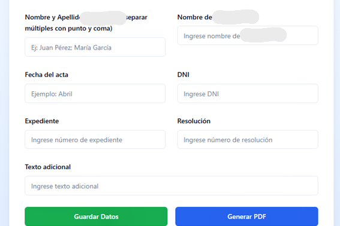
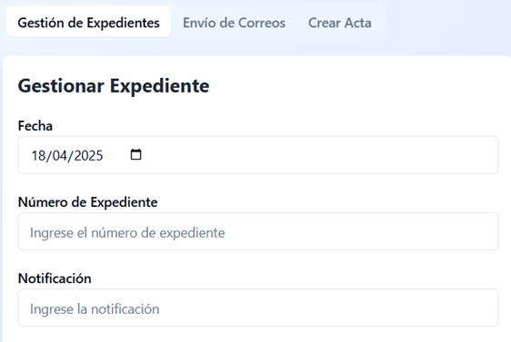

<div align="center">
  
  
  [](https://developer.mozilla.org/en-US/docs/Web/JavaScript)
  [](https://developer.mozilla.org/en-US/docs/Web/CSS)
  [](https://developer.mozilla.org/en-US/docs/Web/HTML)
  [](https://opensource.org/licenses/MIT)
</div>

<hr />

## 📋 Descripción

**GestiónDocs** es una aplicación CRUD diseñada para gestionar datos de documentos, automatizar el envío de correos electrónicos y generar actas en formato PDF.

## ✨ Características

- 📝 **CRUD de documentos**: Crear, leer, actualizar y eliminar datos relacionados con documentos.
- 📧 **Automatización de correos**: Envío automático de emails utilizando los datos almacenados.
- 📄 **Generación de PDFs**: Creación de actas en formato PDF a partir de datos predefinidos.

## 🛠️ Tecnologías utilizadas

<div align="center">
  <table>
    <tr>
      <td align="center" width="96">
        
        <br>JavaScript<br><small>(92.8%)</small>
      </td>
      <td align="center" width="96">
        
        <br>CSS<br><small>(5.9%)</small>
      </td>
      <td align="center" width="96">
        
        <br>HTML<br><small>(1.3%)</small>
      </td>
      <td align="center" width="96">
        
        <br>React
      </td>
      <td align="center" width="96">
        
        <br>Tailwind
      </td>
    </tr>
  </table>
</div>

- **Frontend**: React con componentes UI personalizados y Tailwind CSS para estilos.
- **Backend**: Supabase para almacenamiento de datos.
- **Librerías adicionales**: jsPDF para generación de documentos PDF.

## 🚀 Demo




## ⚙️ Instalación

### Requisitos previos
- Node.js (v14.0.0 o superior)
- npm (v6.0.0 o superior)
- Cuenta en Supabase para la base de datos

### Pasos de instalación

1. **Clona este repositorio**:
   ```bash
   git clone https://github.com/tuusuario/GestionDocs.git
   cd GestionDocs
   ```

2. **Instala las dependencias**:
   ```bash
   npm install
   ```

3. **Configura las variables de entorno**:
   - Copia el archivo `.env.example` a `.env`
   - Completa las variables de conexión a Supabase

4. **Inicia el servidor de desarrollo**:
   ```bash
   npm run dev
   ```

## 📊 Estructura del proyecto

```
GestionDocs/
├── public/          # Archivos estáticos
├── src/             # Código fuente
│   ├── components/  # Componentes React
│   │   └── ui/      # Componentes de interfaz de usuario
│   ├── lib/         # Utilidades y configuración
│   │   └── supabase.js  # Conexión a la base de datos
│   ├── App.jsx      # Componente principal
│   ├── index.css    # Estilos globales
│   └── main.jsx     # Punto de entrada
├── .env.example     # Plantilla de variables de entorno
└── README.md        # Este archivo
```

## 💡 Uso

<details>
<summary>📝 <b>Crear un acta</b> (Click para expandir)</summary>

1. Ingresa el nombre y apellido de la persona
2. Completa los demás campos requeridos
3. Haz clic en "Generar PDF"
4. El documento se descargará automáticamente


</details>

<details>
<summary>🔍 <b>Consultar datos guardados</b> (Click para expandir)</summary>

1. Comienza a escribir el nombre de la persona
2. El sistema autocompletará con los datos guardados
3. Modifica los campos necesarios


</details>

## 🔄 Actualizaciones futuras

- [ ] Integración con sistema de correos electrónicos con EmailJS
- [ ] Panel de administración
- [ ] Soporte para múltiples tipos de documentos
- [ ] Estadísticas y reportes

## 👥 Contribución

Las contribuciones son bienvenidas. Para contribuir:

1. Haz un fork del repositorio
2. Crea una rama para tu característica (`git checkout -b feature/nueva-caracteristica`)
3. Haz commit de tus cambios (`git commit -m 'Añade nueva característica'`)
4. Sube tu rama (`git push origin feature/nueva-caracteristica`)
5. Abre un Pull Request

## 📄 Licencia

Este proyecto está bajo la [licencia MIT](https://opensource.org/licenses/MIT).

<div align="center">
  <br />
  
  <p>
    <sub>Desarrollado con ❤️ en Argentina - VBDeveloper - 2025</sub>
  </p>
</div>"# actas" 
